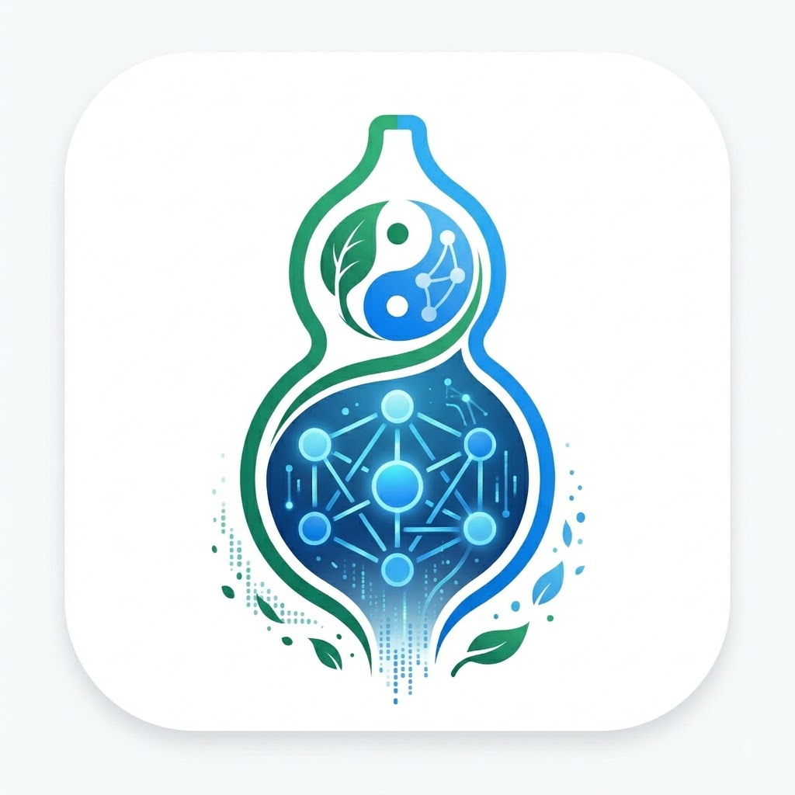

<p align="center">
  <picture>
    <source media="(prefers-color-scheme: dark)" srcset="./image.png">
    
  </picture>
</p>

<h1 align="center">悬壶 · Xuanhu</h1>

<p align="center">
  <strong>中医 AI 辅助诊疗工作台</strong><br>
  <em>AI-Powered Traditional Chinese Medicine Clinical Assistant</em>
</p>

<p align="center">
  <a href="#-核心功能">功能</a> •
  <a href="#-系统架构">架构</a> •
  <a href="#-技术栈">技术栈</a> •
  <a href="#-快速开始">快速开始</a> •
  <a href="#-项目结构">项目结构</a> •
  <a href="#-开发指南">开发指南</a> •
  <a href="#-安全合规">安全合规</a>
</p>

<p align="center">
  <a href="README.md"><strong>English</strong></a> •
  <a href="#"><strong>中文</strong></a>
</p>

---

**悬壶（Xuanhu）** 是一款面向注册中医师的 AI 辅助诊疗工作台。系统覆盖从问诊采集、辨证开方、安全审核到病历生成的完整临床工作流，以清晰、可追溯的方式辅助医师决策。

> ⚕️ **辅助决策工具** — 所有结论仅供参考，需经执业中医师确认后使用。

---

## ✨ 核心功能

### 🔄 端到端临床工作流

一个工作台走完中医问诊全流程：

| 阶段 | 说明 |
|---|---|
| **问诊** | AI 辅助结构化问诊，自动追踪信息完备性，支持澄清恢复 + 槽位级问题契约（R9） |
| **辨证** | 多 Agent 协同辨证，RAG 证据支撑 + 校验链验证 |
| **开方** | 两阶段生成：基础方选择 → 个性化加减方 |
| **医师选方** | 多方案对比展示，含置信度评分——医师从 AI 候选中择优 |
| **安全审核** | 确定性规则引擎检查 10+ 个安全维度，含回退指引 |
| **医师确认** | 强制的"人机环"确认节点，支持修改/驳回 |
| **病历生成** | 结构化诊疗记录导出 |

### 🤖 多 Agent 运行时（LangGraph）

基于 **LangGraph** 构建的 Agent 编排层：

- **采集 Agent** — 结构化四诊信息收集、完备性评估、ABSTAINED 路由与澄清恢复
- **辨证 Agent（SyndromeDraft）** — 证候辨证，RAG 证据支撑 + 校验链验证 + 权威快照缓存
- **开方 Agent（FormulaDraft）** — 两阶段处方生成：基础方草案 → 个性化加减方（加减方），证据支撑
- **安全 Agent** — 处方安全审核门控，确定性规则引擎 + 回退指引
- **恢复 Agent** — 异常处理与会话恢复，防死锁
- **分诊策略** — 自动判断问诊充分性，带缓存的闸门计算

### 🎯 问题契约——槽位级追问完整性（R9）

通用契约层，保证任何问题都不会被"答一半"地静默跳过——系统精确记住自己问过什么，拒绝用粗糙回答关闭一个临床维度：

- **契约冻结** — 每个问题将 1–4 个可核验的覆盖槽位（aspects）冻结为不可变契约；回答产出追加式覆盖事件账本
- **确定性 Rubric 规划** — 全部 11 个十问维度（寒热/汗出/头身/二便/饮食/胸腹/口渴/睡眠/呼吸/疼痛/月经带下）均有版本化 Rubric：必问槽位总是冻结，条件槽位仅在**正性事实**出现时冻结（"睡眠正常"不会拉出多梦易醒；主诉"失眠一周"则会）
- **残余追问链** — 不完整回答（"有痰"但不含颜色/量）强制追问缺失槽位，直到收敛或到达追问上限——不再有被跳过的子问
- **语义充分性校验** — 31 条保守词表把证据不含必需词的过度宣称 `addressed` 降级为 `unclear`（如"有痰"不能满足痰色槽位），槽位留在残余追问中；降级不误伤、不 reject、不扩拒绝面
- **隐私掩码证据** — 身份序列（手机号等）在模型输入前替换为等长 `█`；共享掩码通配匹配器保证引文验证对齐，持久化摘要一律基于**原始**文本而非掩码渲染
- **可观测性** — 契约创建、覆盖折叠、追问决策的受限基数计数器/直方图，外加 6 条 Prometheus 告警规则（degraded / partial / manual-required / cap-reached / integrity-error / failure-rate）

### 🧠 智能 RAG 管线

所有 Agent 推理均基于结构化中医知识库，通过多阶段检索管线实现：

| 阶段 | 组件 | 说明 |
|---|---|---|
| **改写** | Query 改写网关 | 轻量模型（Qwen3.5-2B-free）将临床查询改写为叙事风格，提升检索召回（304–845ms） |
| **检索** | 混合搜索 | Milvus 向量检索 + PostgreSQL 全文检索，8 路并发 + 共享 RAGRetriever |
| **重排** | 多级 Reranker | MVP 加权求和 → Cross-Encoder API（如 jina-reranker-m0）→ LLM Reranker（0–10 评分） |
| **证据** | 结构化 Evidence | 排好序、可追溯的 Evidence 对象，含来源优先级、相关度评分和 chunk 溯源 |

> 🔄 **优雅降级** — 若 Cross-Encoder 或 LLM Reranker 调用失败，系统自动回退至 MVP 加权评分，不阻断检索管线。

### 📊 多方案选方（医师选方）

开方阶段生成**多套候选基础方**——每套方案有独立治疗侧重（侧重）、置信度评分和药味组成——医师可比较后选择最合适的方案：

- **多角度生成** — AI 产出 2–4 套候选基础方，各有不同的治疗优先级侧重
- **置信度评分** — 每套方案含 0–100% 置信度，颜色标记高低
- **并排对比** — 完整药味组成表、方义说明、治疗侧重一目了然
- **一键选用** — 医师选择方案后，系统继续个性化加减方（加减方）

### ⚡ Embedding 缓存预热

三级缓存预热消除向量 Embedding 的冷启动延迟：

| 层级 | 范围 | 说明 |
|---|---|---|
| **L1 实体** | 中药 + 方剂名称 | 预计算知识库中所有已知实体名的 Embedding |
| **L2 模板** | 实体 × 查询模板 | 预计算常见查询模式（如「{中药}的功效与禁忌」）的 Embedding |
| **L3 运行时** | 实时查询 | 正常运行中动态填充 Redis 缓存 |

**效果**：中医问诊场景下 ~60% 缓存命中率，命中延迟 ~4ms（Redis）vs 未命中 ~570ms（网关 RTT），**89–209×** 加速。

```bash
# 全量预热（L1 + L2）
uv run python scripts/prewarm_embedding_cache.py --all

# 预热前后命中率对比
uv run python scripts/prewarm_embedding_cache.py --all --benchmark

# 查看缓存统计
uv run python scripts/prewarm_embedding_cache.py --stats
```

### 🛡️ 确定性安全引擎

不依赖 LLM 的纯函数式安全审核系统，每条处方自动执行以下检查：

| 规则 | 严重度 |
|---|---|
| **十八反** | 🔴 阻断 |
| **十九畏** | 🔴 阻断 |
| **妊娠禁忌** | 🔴 阻断 / 🟠 高危 |
| **配伍禁忌** | 🔴 阻断 |
| **剂量上限**（依据《中国药典》） | 🟠 高危 / 🔴 阻断 |
| **过敏检查** | 🔴 阻断 |
| **剂量单位换算** | 🟡 警告 |
| **未知药名检测** | 🟠 高危 |

> ✅ 安全审核全程不涉及 LLM 调用——所有规则为纯确定性函数，基于结构化中药知识库执行。

### 🖥️ 现代化临床工作台

- **响应式侧栏** — 会话列表，可收起为姓名首字母缩略
- **实时流式传输** — 通过 SSE 实时展示智能体推理过程
- **阶段进度条** — 清晰展示工作流当前阶段
- **多方案选方卡片** — 并排对比 2–4 套基础方案，含置信度与治疗侧重，选择后再加减
- **交互式处方编辑** — 支持安全验证的处方修改，基础方 vs 加减方并排对比
- **医师审核面板** — 支持通过、修改或驳回处方
- **安全确认流程** — 对未解决的安全断言进行人工确认，含回退指引
- **病历预览** — 结构化中医诊疗记录导出

---

## 🏗 系统架构

```
┌──────────────────────────────────────────────────────────┐
│                    前端 (React)                           │
│            xuanhu-ui · Vite · Ant Design                  │
└──────────────────────────┬───────────────────────────────┘
                           │ REST + SSE
┌──────────────────────────▼───────────────────────────────┐
│                 后端 API (FastAPI)                         │
│              app/api · 10+ 路由模块                        │
└──────────────────────────┬───────────────────────────────┘
                           │
┌──────────────────────────▼───────────────────────────────┐
│            智能体运行时 (LangGraph)                         │
│  ┌────────┐ ┌───────────┐ ┌──────────┐ ┌──────────┐     │
│  │ 采集    │ │ 辨证-开方  │ │   安全    │ │   恢复   │     │
│  │ 子图    │ │三Agent流水 │ │   门控    │ │   子图   │     │
│  │        │ │辨证→开方→  │ │          │ │          │     │
│  │        │ │  加减方    │ │          │ │          │     │
│  └────────┘ └───────────┘ └──────────┘ └──────────┘     │
└──────────────────────────┬───────────────────────────────┘
                           │
┌──────────────────────────▼───────────────────────────────┐
│                     基础设施                               │
│  ┌──────────┐ ┌─────┐ ┌──────────┐ ┌──────────────────┐  │
│  │PostgreSQL│ │Redis│ │  Milvus  │ │     模型网关      │  │
│  │   16     │ │  7  │ │ (向量库)  │ │  ┌────────────┐  │  │
│  │          │ │     │ │          │ │  │主网关(mimo) │  │  │
│  │          │ │     │ │          │ │  ├────────────┤  │  │
│  │          │ │     │ │          │ │  │改写(Qwen)  │  │  │
│  │          │ │     │ │          │ │  ├────────────┤  │  │
│  │          │ │     │ │          │ │  │Reranker   │  │  │
│  │          │ │     │ │          │ │  ├────────────┤  │  │
│  │          │ │     │ │          │ │  │Embedding  │  │  │
│  └──────────┘ └─────┘ └──────────┘ └──┴────────────┘  │  │
└──────────────────────────────────────────────────────────┘
```

### 关键设计决策

- **领域驱动设计（DDD）** — 采用 CQRS + Outbox 事件模式，确保事件可靠发布
- **幂等 HTTP 命令** — 所有状态变更操作使用幂等键，自带冲突检测
- **快照读模型** — 会话状态实时投影为只读物化视图，查询性能优化
- **共享 LangGraph 运行时** — 应用生命周期内维护一个编译后的图实例，跨请求复用
- **安全优先** — 确定性规则始终先于任何 LLM 输出执行
- **多网关架构** — 主推理、Query 改写（Qwen3.5-2B）、Embedding、Reranker 各自独立网关，可独立配置并支持降级回退
- **权威快照缓存** — 推理 Agent 的权威快照在 commit 时缓存，写入时失效，DB 往返减少 60–70%
- **三级 Embedding 缓存** — 实体 → 模板 → 运行时三级预热（Redis），~60% 命中率，~4ms 取回
- **两阶段开方** — 基础方选择（多方案、医师选定）→ 个性化加减方（加减方），临床过程透明分离
- **确定性问题契约（R9）** — 每个问题将可核验槽位冻结为不可变契约；回答折叠进追加式覆盖账本；残余追问只补问缺失槽位直至收敛——粗糙回答无法静默关闭临床维度
- **租约守护的持久命令** — 持久异步命令 worker 与 HTTP 幂等执行器都在共享的单调租约守护（`app/services/lease_guard.py`）下运行 handler。只有能持续续租，handler 才能继续写入；一旦 owner token/状态丢失或本地截止时间耗尽，过期 handler 会被取消/排空，执行器安全失败（`HTTP_COMMAND_RECOVERY_REQUIRED`），绝不结算过期的临床写入。运维人员通过异步 worker 的环境设置（env/config）调整其租约/心跳时序（生产默认：心跳 20s / 租约 60s）。HTTP 执行器的租约/心跳时序在生产环境固定（20s / 90s），其构造参数仅作内部/测试注入，不是运维配置面。

---

## 🛠 技术栈

### 后端

| 类别 | 技术选型 |
|---|---|
| Web 框架 | [FastAPI](https://fastapi.tiangolo.com/) |
| 运行环境 | Python 3.12 |
| Agent 编排 | [LangGraph](https://www.langchain.com/langgraph) |
| 数据库 ORM | SQLAlchemy 2.0 + Alembic |
| 业务数据库 | PostgreSQL 16 |
| 缓存/锁 | Redis 7 |
| 向量数据库 | Milvus 2.5（etcd + MinIO） |
| 主 LLM 网关 | deepseek-v4-flash-0731 @ dmxapi（多网关独立配置） |
| Query 改写网关 | 轻量模型（如 qwen3-8b）用于 RAG 查询改写 |
| Reranker | Cross-Encoder（如 jina-reranker-m0）+ LLM 降级 |
| Embedding | Qwen3-Embedding-8B，通过独立 Embedding 网关 |
| 数据校验 | Pydantic v2 |
| 代码质量 | Ruff + mypy（严格模式） |

### 前端

| 类别 | 技术选型 |
|---|---|
| 框架 | React 19 |
| 构建工具 | Vite 8 |
| UI 组件库 | Ant Design 6 |
| 语言 | TypeScript 6 |
| 路由 | React Router 7 |
| 测试 | Vitest + Testing Library + Playwright |
| 代码检查 | oxlint |

### DevOps

| 工具 | 用途 |
|---|---|
| Docker Compose | 本地中间件编排 |
| Prometheus | 监控（15 条告警规则：outbox / R5 安全 / R9 问题契约） |
| gitleaks | 密钥扫描 |

---

## 🚀 快速开始

### 前置依赖

- Python 3.12+
- Node.js 20+
- Docker & Docker Compose
- [uv](https://docs.astral.sh/uv/)（Python 包管理器）

### 1. 克隆与配置

```bash
git clone https://github.com/yourusername/xuanhu.git
cd xuanhu

# 配置环境变量
cp .env.example .env
# 编辑 .env 文件，填入模型网关地址、数据库凭证等配置
```

### 2. 启动基础设施

```bash
docker compose up -d
```

将启动 PostgreSQL 16、Redis 7、Milvus（含 etcd + MinIO）。

### 3. 后端启动

```bash
# 创建虚拟环境并安装依赖
uv sync

# 执行数据库迁移
uv run alembic upgrade head

# 导入知识库数据（可选）
uv run python scripts/seed_data.py

# 启动 API 服务
uv run xuanhu-api
```

API 服务地址：`http://localhost:8000`，交互式文档：`/docs`。

### 4. 前端启动

```bash
cd frontend
npm install
npm run dev
```

前端地址：`http://localhost:5173`。

### 5. 验证

```bash
# 健康检查
curl http://localhost:8000/api/v1/health

# 就绪检查
curl http://localhost:8000/api/v1/health/ready
```

---

## 📁 项目结构

```
xuanhu/
├── app/                          # 后端应用
│   ├── agent_runtime/            # LangGraph 智能体编排
│   │   ├── graph.py              # 主状态图构建
│   │   ├── intake_subgraph.py    # 患者问诊采集子图
│   │   ├── reasoning_subgraph.py # 辨证开方子图
│   │   ├── review_node.py        # 审核门控子图
│   │   ├── recovery_node.py      # 异常恢复子图
│   │   ├── routing.py            # 命令路由逻辑
│   │   ├── runner.py             # 图执行器
│   │   ├── state.py             # 全局状态定义
│   │   ├── context_builder.py   # LLM 上下文组装
│   │   ├── repository.py        # 领域仓储（CQRS + outbox，fail-closed 信封）
│   │   ├── checkpoint.py        # PostgreSQL 检查点持久化
│   │   ├── reducer.py           # 领域状态规约 & 追加式账本
│   │   ├── question_contract.py # R9 问题契约折叠 & 残余追问链
│   │   ├── question_rubric.py   # R9 维度 Rubric（11 个十问维度）
│   │   ├── coverage_semantics.py# R9 语义充分性词表
│   │   ├── contract_projection.py # R9 契约 → 维度投影
│   │   ├── intake_verifier.py   # 采集输出校验链
│   │   ├── intake_grounding.py  # 证据接地 & 隐私掩码处理
│   │   ├── completeness_policy.py # 必填维度完备性评估
│   │   ├── async_command*.py    # 持久化异步命令 worker 与生命周期
│   │   ├── sandbox_*.py         # 沙箱评估模块
│   │   └── verifiers.py         # 共享输出校验链
│   ├── agents/                   # LLM Agent 提示词与逻辑
│   │   ├── syndrome_draft.py    # 辨证草案 Agent（L4-1）
│   │   ├── formula_draft.py     # 开方+加减 Agent（L4-2, 两阶段）
│   │   ├── prompts/             # Jinja2 提示词模板（23）
│   │   │   └── manifest.yaml    # 提示词注册表
│   │   └── prompt_loader.py     # 提示词模板加载器
│   ├── api/                      # REST API 路由
│   │   ├── sessions.py           # 会话 CRUD
│   │   ├── messages.py           # 消息管理
│   │   ├── advance.py            # 阶段推进（幂等）
│   │   ├── review.py             # 医师审核
│   │   ├── stream.py             # SSE 流式传输
│   │   ├── record.py             # 病历操作
│   │   └── recovery.py           # 会话恢复
│   ├── core/                     # 核心配置与基础设施
│   │   ├── config.py             # 应用配置（pydantic-settings）
│   │   ├── gateway.py            # 主模型网关客户端
│   │   ├── rewrite_gateway.py    # Query 改写网关配置
│   │   ├── reranker_gateway.py   # Reranker 网关配置
│   │   ├── embedding_gateway.py  # Embedding 网关配置
│   │   └── redis.py              # Redis 客户端
│   ├── rag/                      # 检索增强生成
│   │   ├── retriever.py          # 混合检索：Milvus + PG 全文
│   │   ├── reranker.py           # 多级重排（MVP/Cross-Encoder/LLM）
│   │   ├── embedding_cache.py    # Redis Embedding 缓存
│   │   ├── entity_index.py       # 实体级索引
│   │   ├── reasoning_retrieval.py # Agent 触发式 RAG 检索
│   │   └── schemas.py            # RAG 数据结构（Evidence, MergedHit）
│   ├── db/                       # 数据库会话管理
│   ├── models/                   # SQLAlchemy ORM 模型
│   ├── safety/                   # 确定性安全引擎
│   │   ├── engine.py             # 核心规则引擎（10+ 规则）
│   │   ├── datasets.py           # 中药配伍禁忌表
│   │   ├── normalizer.py         # 中药名标准化
│   │   └── rule_version.py       # 规则版本追踪
│   ├── schemas/                  # Pydantic 数据模型（API 层）
│   └── services/                 # 业务逻辑服务层
├── frontend/                     # React SPA 前端
│   └── src/
│       ├── components/           # UI 组件
│       │   ├── ChatPanel.tsx     # 问诊对话主面板
│       │   ├── SessionSider.tsx  # 会话导航侧栏
│       │   ├── SessionList.tsx   # 会话列表
│       │   ├── MessageList.tsx   # 消息列表
│       │   ├── MessageInput.tsx  # 输入栏
│       │   ├── StepBar.tsx       # 工作流阶段指示器
│       │   ├── StageResultsPanel.tsx  # 阶段结果（辨证/处方/安全卡片 + P1 多方案选方）
│       │   ├── ReviewActionsBar.tsx  # 医师审核操作栏
│       │   ├── FormulaEditModal.tsx   # 处方编辑弹窗
│       │   ├── RecordPanel.tsx   # 病历展示面板
│       │   └── SafetyConfirmationPanel.tsx  # 安全确认面板
│       ├── hooks/                # React Hooks
│       ├── api/                  # API 客户端
│       ├── types/                # TypeScript 类型定义
│       ├── utils/                # 工具函数
│       └── styles/               # 样式与主题
├── data/                         # 知识库初始数据
├── deploy/                       # 部署配置
│   └── prometheus/               # 监控告警规则
├── docs/                         # 完整技术文档（按主题归档 01–08/10）
├── scripts/                      # 工具脚本
│   ├── prewarm_embedding_cache.py # Embedding 缓存预热 CLI
│   ├── perf_benchmark.py         # 性能压测套件
│   ├── test_p2_rewrite_gateway.py    # 改写网关端到端测试
│   ├── test_reranker_conn.py     # Reranker 连通性测试
│   └── seed_data.py              # 知识库初始数据导入
├── tests/                        # 测试套件（3200+ 测试用例）
├── docker-compose.yml            # 中间件编排
├── pyproject.toml                # Python 项目配置
└── .env.example                  # 环境变量模板
```

### 📚 文档

文档集位于 `docs/`，按主题归档（每个子目录自包含、带编号总览）：

| 目录 | 主题 |
|---|---|
| [01_agent部分优化](docs/01_agent部分优化/) | Agent 架构演进、LangGraph 大修、收敛性重写 |
| [02_agent逻辑优化](docs/02_agent逻辑优化/) | 单一后端收敛、网关超时、柔性采集 |
| [03_agent性能优化](docs/03_agent性能优化/) | OP1–OP4 性能画像与优化、Embedding 缓存预热 |
| [04_生产环境加固](docs/04_生产环境加固/) | 认证授权、PHI 访问控制、网络边界、灰度上线 |
| [05_RAG效果评测](docs/05_RAG效果评测/) | RAG 评测实验设计、指标合同、消融实验 |
| [06_项目总结](docs/06_项目总结/) | 项目全貌：架构、Agent、RAG、性能、加固、测试 |
| [07_面试宝典](docs/07_面试宝典/) | 面试视角的系统设计、RAG、Agent、性能叙事 |
| [08_后续优化](docs/08_后续优化/) | R9 问题契约方案与实施记录 |
| [async-command.md](docs/async-command.md) | 持久化异步命令（R6/R7）设计 |

---

## ⚡ 性能优化

Agent 运行时经过了四个维度（OP1–OP4）的系统性画像与优化。以下数据均在本地 Docker（PG/Redis/Milvus）+ 云端模型网关环境实测。

### 优化总览

| 类别 | 指标 | 优化前 | 优化后 | 提升 |
|---|---|---|---|---|
| **OP1 状态下推** | 每次 claim 的推理 DB 往返 | 10+ | 1–2 | ~60–70% 减少 |
| **OP1 问诊** | 每次 finalize 调用 `_compute_intake_from_claim` 次数 | 4×（每路由一次） | 1×（缓存） | 4→1 |
| **OP1 权威缓存** | 推理权威快照每轮读取 | 每次冷 DB 查询 | Redis 缓存，commit 后失效 | 热路径消除 DB |
| **OP2 网关池化** | Health/LLM 首次 vs 复用 | ~5.0s vs ~2.0s | ~5.0s vs ~1.1s | 复用快 ~4.7× |
| **OP2 Embedding 缓存** | 缓存命中率（中医问诊场景） | 0%（无缓存） | **60.0%** | 门禁 ≥40% ✅ |
| **OP2 Embedding 缓存** | 未命中（网关 RTT）vs 命中（Redis） | ~570ms | ~4ms | **~89–209×** 加速 |
| **OP2 Embedding 预热** | 冷启动缓存覆盖 | 0 条 | 3,979 条（467 L1 + 3,512 L2） | ~350 MB Redis, ~539s 预热 |
| **OP3 Milvus 异步** | 8 路并发向量检索耗时 | 串行阻塞 | 0.38–0.43s | **2.84–3.14×** 加速 |
| **OP3 M1 Content** | 每次 chunk 命中 PG 回填往返 | 1 次 DB 查询 | **~0ms**（Milvus 直出） | v4 collection 迁移后消除 |
| **OP3 Reranker** | 证据相关度排序 | 仅 MVP 加权求和 | Cross-Encoder / LLM Reranker → top-8 | 深度语义匹配；优雅降级 |
| **OP3 改写网关** | RAG 查询质量 | 原始结构化查询 | LLM 改写为叙事风格查询 | Qwen3.5-2B-free @ dmxapi（304–845ms） |

### 可观测性

- `GET /api/v1/metrics` — 15 个受限基数 `xuanhu_*` 指标族（6 计数器 + 9 直方图），含 R9 问题契约计数器与槽位数直方图
- 直方图：`rag_vector_search`、`rag_fulltext_search`、`rag_backfill`、`rag_embed`、`gateway_chat`、`gateway_embed`、`graph_node`、`reasoning_get_state`、`question_contract_aspects`
- Prometheus 告警规则：共 15 条（outbox 积压 5、R5 安全 4、R9 问题契约 6），每条带最小样本量护栏，`promtool` 正反场景测试通过

### 压测

```bash
# 完整性能压测套件（需要运行中的 API + 基础设施）
uv run python scripts/perf_benchmark.py

# Embedding 缓存预热 + 命中率对比
uv run python scripts/prewarm_embedding_cache.py --all --benchmark

# 改写网关端到端延迟测试
uv run python scripts/test_p2_rewrite_gateway.py
```

结果输出至 `scripts/perf_results.json` 和 `scripts/prewarm_benchmark_result.json`。

### 回归门禁（CI）

- 完整 `pytest` 套件（3200+ 测试用例，含 R9 问题契约单测）— 无回归
- `tests/golden/test_langgraph_performance_baseline.py` — P95 < 5000ms
- Embedding 缓存命中率 — ≥ 40%
- 结构化解析成功率 — 不下降 ≥1pp
- Milvus v4 collection 含 `content` 字段 — backfill ~0ms 已验证
- Golden 测试断言覆盖真实推理流量 — after 数据已验证
- `promtool check rules` / `test rules` — 告警规则正反场景验证
- 严格 `mypy`（`app` + `scripts`）— 229 个源文件 0 问题

> 📊 详细方法论、before/after 对比表及逐阶段分析：[Agent 性能优化](docs/03_agent性能优化/)

---

## 🧪 开发指南

### 运行测试

```bash
# 后端测试
uv run pytest

# 运行含集成标记的测试
uv run pytest -m integration

# 前端测试
cd frontend
npm test
npm run test:watch   # 监听模式
```

### 代码质量

```bash
# 后端
uv run ruff check .
uv run mypy app/

# 前端
cd frontend
npm run lint
npm run typecheck
```

### 提交规范

本项目使用约定式提交（Conventional Commits）。提交前请确保：

- 所有代码检查通过（`ruff`、`mypy`、`oxlint`）
- 测试全部通过（`pytest`、`vitest`）
- 无密钥泄露（`gitleaks`）

---

## 🔒 安全合规

### 临床安全原则

1. **医师在环** — 每条处方必须经执业医师确认才能生成正式病历
2. **确定性安全优先** — 配伍禁忌、剂量上限、妊娠禁忌等检查为纯规则引擎，绝不委托给 LLM
3. **保守妊娠处理** — `pregnant` 和 `possible` 状态均触发完整的妊娠禁忌规则
4. **无"接受风险继续"** — `BLOCKER` 和 `HIGH` 级别问题系统不予放行，仅可由执业医师审慎判断后手动处理
5. **完整审计追溯** — 每次安全检查、Agent 动作和用户操作均以 trace_id 记录，全链路可追溯

### 数据安全

- 所有模型调用均通过内网模型网关，患者数据不接触外部 LLM 供应商
- **模型输入前身份掩码** — 手机号、证件号等身份序列在 LLM 可见前替换为等长 `█`；证据摘要始终覆盖原始文本，掩码引文仍可验证（R9）
- 会话数据按医师隔离
- MVP 范围明确不接入 HIS/EMR

---

## 🤝 参与贡献

本项目处于早期开发阶段。如果你想参与：

1. Fork 本仓库
2. 创建功能分支（`git checkout -b feature/amazing-feature`）
3. 提交变更（`git commit -m 'feat: add amazing feature'`）
4. 推送到分支（`git push origin feature/amazing-feature`）
5. 发起 Pull Request

请确保代码通过所有代码检查和测试后再提交。

---

## 📄 许可证

**UNLICENSED** — 本项目目前不开放公开使用或分发。

---

<p align="center">
  <sub>为中医社区而建 ❤️</sub>
</p>